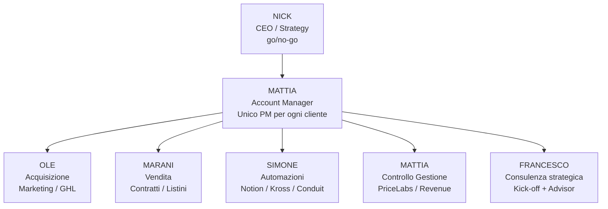

Questa pagina fissa **chi è responsabile di cosa** nel delivery Mattone. Il principio che guida la ristrutturazione: **nessuno è responsabile di tutto**. Prima Mattia e Ole coprivano tutto, ma se mancava Mattia entrava Nick in delivery — con perdita di qualità e tempo strategico. Ora ogni verticale ha **un owner competente** e Nick decide solo go/no-go.

<Warning>
**Principio di delega — non negoziabile.**
Ogni verticale ha UN owner. A Nick arriva SOLO **go/no-go** (vedi [Escalation Matrix in Journey & Cadenze](/delivery/journey-e-cadenze#escalation-matrix--quando-serve-nick-gono-go)). Tutto il resto lo decide l'owner del verticale.
</Warning>

## Organigramma

## I 4 verticali della delivery

Il servizio Mattone si divide in **4 aree operative**. Ogni verticale ha un owner unico + un backup/consulente per casi limite.

| Verticale | Cosa comprende | Owner | Backup |
|---|---|---|---|
| **1. Acquisizione** | Marketing GHL, PIT, landing, Ads, funnel lead, tracking | **Ole** | Marani (vendita commerciale) |
| **2. Vendita** | Contrattatica, listini, upsell, pricing negoziale, offerte custom | **Marani** | Ole (marketing operativo) |
| **3. Automazioni** | Notion, Kross, Conduit, integrazioni, custom tools, KB Bridge | **Simone** | Mattia (per casi Conduit avanzati) |
| **4. Controllo di Gestione** | PriceLabs, revenue, annunci Airbnb/Booking, Finance, reporting | **Mattia** | Francesco (per casi strategici) |

<Note>
Ogni owner è **la persona più esperta** del suo verticale nel team Mattone. Perché ha senso: se il cliente ha un problema di annunci PriceLabs, deve parlare con chi conosce PriceLabs meglio degli altri — non con chi "è disponibile".
</Note>

## Mattia — Account Manager (ruolo unico)

Mattia è il **PM unico per ogni cliente**. Fa da hub tra il cliente e i 4 verticali. Ha anche la ownership del verticale Controllo di Gestione (doppio hat).

### Cosa fa Mattia
- **Onboarding** ogni nuovo cliente (kick-off tecnico dopo Francesco)
- **Contatto giornaliero** con clienti (o supervisiona il team che li contatta)
- **Call one-to-one** solo per casi urgenti (non richieste normali)
- **Escalation router**: raccoglie i problemi, li assegna al verticale competente
- **Owner Controllo di Gestione**: PriceLabs, revenue, annunci

### Cosa NON fa Mattia
- Non risolve problemi tecnici Notion/Kross/Conduit → **Simone**
- Non gestisce marketing/GHL → **Ole**
- Non fa contrattatica → **Marani**
- Non decide policy/prezzi custom → **Nick (go/no-go)**

<Tip>
Il modello single-PM funziona quando l'AM **non risolve tutto lui**, ma sa a chi girare cosa. La forza di Mattia è la **classificazione rapida**, non la competenza universale.
</Tip>

## Consulenze di gruppo — chi tiene cosa

Il cliente entra in **4 consulenze di gruppo tematiche settimanali** + una strategica mensile. Ognuna ha un owner scelto per competenza.

| Consulenza | Owner | Cadenza | Chi partecipa |
|---|---|---|---|
| **Vendita** | Marani | 1x settimana | Clienti con contrattatica attiva |
| **Automazioni** | Simone | 1x settimana | Clienti su Notion/Kross/Conduit |
| **PriceLabs / Controllo Gestione** | Mattia | 1x settimana | Clienti Advanced con revenue |
| **Consulenza strategica** | Francesco | 1x mese o on-demand | Clienti in kick-off + advisory |

<Note>
Le consulenze di gruppo NON sono call di supporto individuale — sono momenti formativi tematici. Il supporto individuale (call 1-1) è ownership Mattia (o del verticale competente su casi tecnici specifici).
</Note>

## Flusso di escalation — chi chiama chi

<Steps>
  <Step title="1. Cliente scrive">
    Il cliente scrive sempre a Mattia — WhatsApp gruppo cliente, mai direttamente al verticale.
  </Step>
  <Step title="2. Mattia classifica in 30 secondi">
    Mattia legge il problema e lo assegna al verticale competente:
    - Setup GHL / Ads / Lead → **Ole**
    - Contratto / Listino / Upsell → **Marani**
    - Notion / Kross / Conduit → **Simone**
    - PriceLabs / Revenue / Annunci → **Mattia (risolve lui)**
    - Strategia business → **Francesco** (consulenza)
    - Deroga / Custom / Blocco → **Nick (go/no-go)**
  </Step>
  <Step title="3. Verticale risolve">
    L'owner del verticale ha SLA definiti (vedi [Journey & Cadenze](/delivery/journey-e-cadenze)). Se blocca su qualcosa → escala a Mattia (mai a Nick direttamente).
  </Step>
  <Step title="4. Mattia chiude il loop">
    Mattia notifica il cliente della risoluzione + aggiorna il ticket ClickUp. Solo dopo la conferma cliente, il thread è chiuso.
  </Step>
</Steps>

## Comunicazione interna

**Canale #delivery (Slack / WhatsApp gruppo team):**
- Ogni cliente ha **un thread** dedicato
- Update procedure → sempre con link al doc (`docs.mattone.co`)
- Escalation a Nick → formato standard: `cliente – opzioni – proposta – go/no-go?`
- Nessuna richiesta a Nick senza proposta del team

**Weekly kick-off — Lunedì 09:30 (30 min):**
Partecipa TUTTA la delivery (Mattia + Ole + Marani + Simone + Nick se ci sono go/no-go). Ordine del giorno:
- Stato clienti (semaforo: ok / a rischio / bloccato)
- Blocker della settimana + owner
- Aggiornamenti procedure (link + 1 riga di cosa cambia)
- Cadenze consulenze della settimana + copertura

**Retrospettiva SOP — primo lunedì del mese (60 min):**
Il team scorre i doc e chiede: cosa non è più vero? cosa manca? cosa è cambiato nella realtà ma non nella doc? Le modifiche emerse diventano PR entro la settimana.

## Se qualcuno manca — piano di continuità

Il modello a verticali è robusto SE ogni owner ha un backup che sa almeno gestire i casi urgenti.

| Se manca | Copertura urgente | Cosa NON copre |
|---|---|---|
| **Mattia** | Marani prende i contatti clienti routine | Consulenza PriceLabs (rimanda) |
| **Ole** | Marani gestisce le richieste marketing base | Setup GHL nuovi clienti (rimanda) |
| **Marani** | Ole gestisce contrattatica routine | Consulenza Vendita di gruppo (rimanda) |
| **Simone** | Mattia gestisce Conduit routine (custom tools noti) | Debug KB Bridge / integrazioni nuove (rimanda) |

<Warning>
Se manca **due o più verticali contemporaneamente** → escalation a Nick per prioritizzare cosa slittare. Non improvvisare copertura ibrida.
</Warning>

## Riferimenti
<CardGroup cols={2}>
  <Card title="Customer Journey + Cadenze" icon="route" href="/delivery/journey-e-cadenze">Percorso end-to-end cliente + escalation matrix + templates</Card>
  <Card title="Onboarding Conduit cliente" icon="server" href="/delivery/onboarding-conduit-cliente">Procedura tecnica Conduit (Strada A + B)</Card>
  <Card title="Marketing onboarding" icon="megaphone" href="/delivery/marketing-onboarding">Fase Ole GHL end-to-end</Card>
  <Card title="Personalizzazione studente" icon="user-gear" href="/delivery/personalizzazione-studente">Config per cliente</Card>
</CardGroup>
